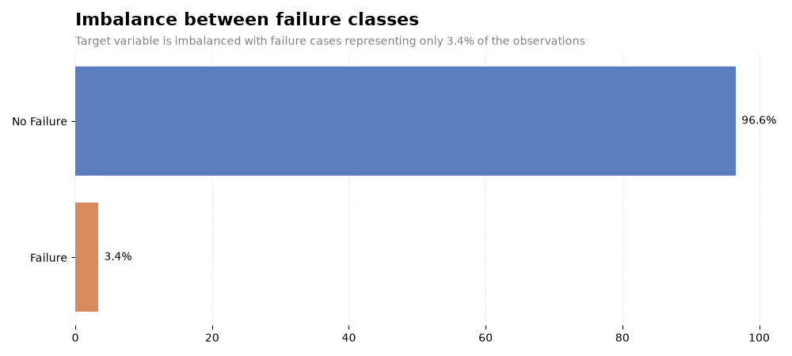
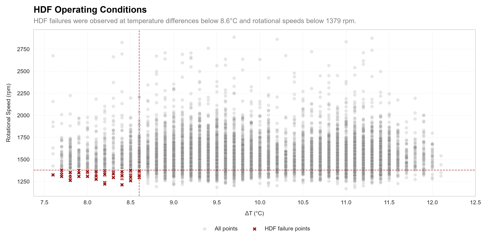
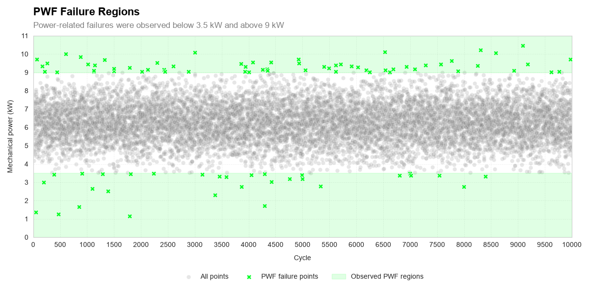
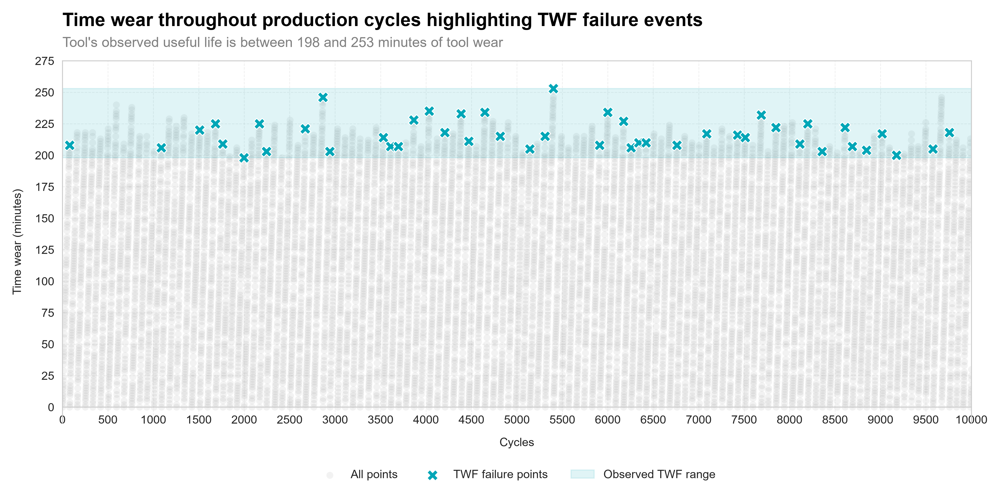
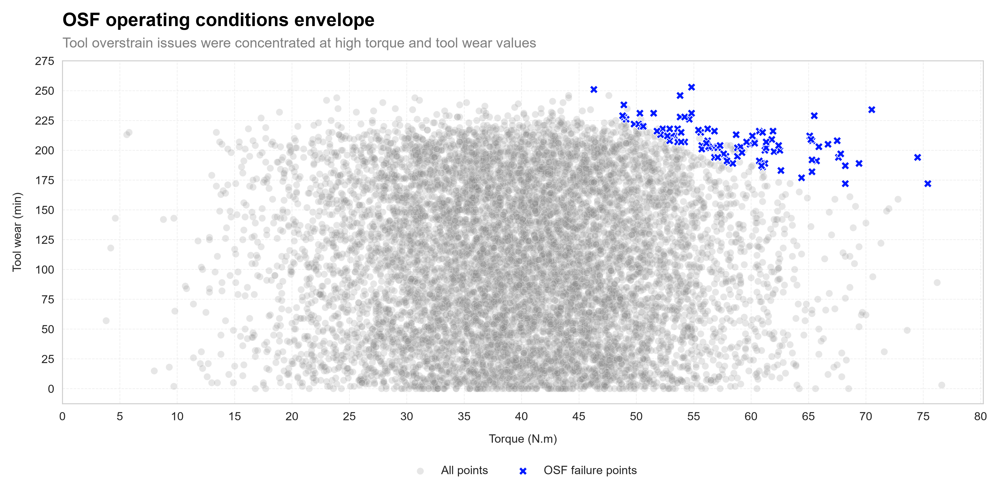

# Milling Machine Failure Prediction

Repository for exploratory analysis of AI4I Predictive Maintenance dataset (Kaggle) and classification of failures.

## 🎯 Business Context & Problem Framing

- The Problem: unexpected machine failures interrupt production and require unplanned maintenance, increasing operational costs and downtime.

- The Objective: investigate the relationship between process variables and machine failures and develop a classification system to identify operations at higher risk of failure.

- The Approach: historical operating conditions and failure records from a CNC machine are analyzed to identify relevant patterns and train a binary classification model.

- The Decision: model predictions can support preventive inspection decisions, with the classification threshold selected according to the acceptable trade-off between missed failures and unnecessary inspections.

## 🎯 Key Results

✔ Well defined failure operating envelopes identified:

| Variable | Limits | Failure Mode
| --- | --- | ---
| Temperature Difference | Below 8.6 °C | Heat Dissipation Failure (HDF)
| Rotational Speed | Below 1379 rpm | Heat Dissipation Failure (HDF)
| Mechanical Power | Below 3.5kW and above 9kW | Power Failure (PWF)
| Tool wear | Between 198 and 253 minutes | Tool Wear Failure (TWF)

✔ Useful new features: Temperature Difference and Mechanical Power

✔ The best-performing model achieved a recall of XX% on the test set

✔ Model interpretation showed that [features] were the main contributors to failure predictions.

✔ A Streamlit dashboard was developed to simulate failure-risk assessment for individual operations.

## 🗂️ Dataset

The analysis uses the AI4I 2020 Predictive Maintenance Dataset, which contains 10,000 observations of machine operating conditions and failure events. The dataset includes process variables such as air and process temperature, rotational speed, torque and tool wear, along with binary indicators for different failure modes.

For the predictive model training, the following variables were used:

| Feature | Description |
| --- | --- |
| product_type | Quality of the machined product |
| air_temperature_celsius | Air temperature |
| process_temperature_celsius | Process temperature |
| rotational_speed_rpm | Rotational Speed |
| torque_nm | Torque |
| tool_wear_min | Tool wear accumulated during operation |
| machine_failure | Binary indicator of failure |

## 🧭 Exploratory Data Analysis key findings

### Class imbalance

### New Features

The following new featured prooved to be useful in indetifying failure envelopes:

- Temperature Difference - $\Delta T(°C)$

$$\Delta T(°C) = T_{process} - T_{air}$$

- Mechanical Power - $P(kW)$

$$\dfrac{\omega(rad/s) \cdot \tau(N.m)}{1000}$$

### Heat Dissipation Failure Operating Conditions

### Power Failure Regions

### Tool Wear Observed Useful Life

### Overstrain Failure Operating Envelope

## 🤖 Failure Classification

### Model comparison

| Model | Recall | Precision | ROC-AUC |
|---|---:|---:|---:|
| Logistic Regression | XX | XX | XX |
| Decision Tree | XX | XX | XX |
| Random Forest | XX | XX | XX |

### Model selection

The selected model was [MODEL] based primarily on its ability to detect failure conditions while maintaining an acceptable false-positive rate.

### Model interpretation

The main features associated with failure predictions were:

1. ...
2. ...
3. ...

Local explanations were also used to investigate why individual operations were classified as potential fa

## 📊 Streamlit Dashboard

## 📝 Recomendations & Future Implementations

- Establish an operational decision threshold based on the acceptable false-positive rate and the cost of preventive inspection.

- Integrate real-time sensor measurements into the prediction pipeline.

- Collect additional failure observations to improve model robustness.

- Monitor model performance after deployment to detect changes in machine operating conditions.

- Investigate whether individual failure modes can be predicted separately.

## 💻 Data Analysis Framework & Architecture

(1) All the data collected by the engineering staff was organized in their local PostgreSQL server and named as 'milling_shop_db'

(2) The database connection was established using DBeaver as the management tool and SQL development environment

(3) Preliminary information about the database such as schema organization, name of the columns and data types were investigated with the help of DBeaver interface and the findings were organized in the '🗂️ Column data types, sizes and constraints' session

(4) Data inconsistencies such as duplicates, nulls and invalid values were investigated using the SQL code written in the script '01_quality_analysis'

(5) Basic statistical metrics were evaluated for both categorical and numerical features using the SQL code written in the scripts '02_statistical_profiling_categorical' and '03_statistical_profiling_numerical'

(6) Preliminary investigation of relevant aggregations was done using the SQL queries written in the script '04_analysis_of_aggregations', some other auxiliary scripts can be found at '/sql' folder

(7) Further investigation of the statistical behaviour of the data using visualization tools (boxplots, histograms and scatter plots) was performed using Python libraries such as Pandas, Matplolib and Seaborn and the code was organized in the jupyter notebook '01_exploration_and_profiling'. The key findings from data quality checks and basic profiling done in the previous steps were documented in the same jupyter notebook.

(9) All information extracted in the previous stages was used to update the column dictionary presented in the '📖 Column Dictionary' session

(10) Process variables analysis was performed in order to find potential trigger values for predicting failure modes.

EDA -> TREINAMENTO DE UM ALGORITMO DE CLASSIFICAÇÃO -> DASHBOARD EM STREAMLIT -> APRESENTAÇÃO DE SLIDES

[TO-DO: ao final da escrita desta sessão resumir as etapas em um fluxograma e anexar]
[TO-DO: colocar links nas referências aos arquivos]

